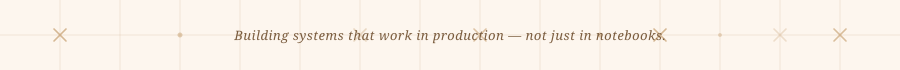

 

 

---

## About

I am a Software Engineer specialising in production-grade backend systems, distributed architectures, and AI-powered applications. My work covers the full stack from training computer vision models and engineering RAG pipelines through to containerising microservices and orchestrating Kubernetes deployments.

I am currently employed as a Full Stack Developer at **Adzoira** while leading the development of **SkinSense**, an AI-powered virtual dermatology platform. It combines Vision Transformers, a hybrid RAG pipeline using BM25, FAISS, and neural reranking, FastAPI microservices, a Next.js frontend, PostgreSQL, and Redis. The entire system is Dockerised and Kubernetes-orchestrated for production.

- Bachelor of Science in Software Engineering at FAST NUCES Peshawar, graduating May 2026
- Delivers end to end: model training, API design, frontend, containerisation, and cluster deployment
- Android mobile development with Jetpack Compose, MVVM, Hilt, Retrofit, and Room
- Linux-native workflow with an infrastructure-first engineering mindset
- Currently employed full time with two successfully delivered client contracts

---

## Professional Experience

**Full Stack Developer at [Adzoira](https://www.adzoira.com)**
Remote, Full-Time — January 2026 to Present

Building scalable full-stack web applications using React, TypeScript, and Supabase with serverless Edge Functions to reduce global latency. Responsible for PostgreSQL schema design and query optimisation, rigorous quality assurance before every release, and cross-functional collaboration to maintain modern engineering standards throughout the product.

---

**Full-Stack Software Engineer at ProEMS**
Remote, Contract — March 2026 to April 2026

Architected and delivered a complete enterprise-grade corporate event management platform from the ground up using React, FastAPI, PostgreSQL, and Supabase. Built secure RESTful APIs with JWT authentication and role-based access control for multi-user workflows. Applied SonarQube static analysis throughout and delivered full deployment documentation with post-launch support.

---

**Software Engineer — Event Ticketing Platform**
Remote, Contract — November 2025 to December 2025

Delivered a production-ready event ticketing platform within a four-week engagement. Designed and implemented over 15 secure REST API endpoints with JWT-based role-based access control covering Admin, Organiser, and Attendee roles. Built a GitHub Actions CI/CD pipeline for automated testing and zero-downtime deployment to Microsoft Azure. Validated a QR-based check-in system with over 100 live ticket scan tests.

---

## Featured Projects

<table>
<tr>
<td width="50%" valign="top">

### SkinSense — AI Dermatology Platform
[View Live Demo](https://frontend-sandy-two-46.vercel.app/)

An AI-powered virtual skin clinic combining dermatology image analysis with symptom-text reasoning. Built a multimodal inference pipeline using Vision Transformers and large language models for clinical severity assessment. Engineered a hybrid RAG architecture over medical literature using BM25, dense embeddings, FAISS indexing, and neural reranking.

`Vision Transformers` `FastAPI` `BM25` `FAISS` `Sentence Transformers` `Next.js` `PostgreSQL` `Redis` `Docker` `Kubernetes`

</td>
<td width="50%" valign="top">

### DreamCanvas — Polyglot Microservices Platform

A distributed nine-service architecture using Node.js, Flask, PostgreSQL, and Redis. Implemented a central API Gateway for routing, authentication, and service orchestration. Authored full Kubernetes manifests including Deployments, StatefulSets, Services, Ingress, ConfigMaps, and Secrets.

`Node.js` `Flask` `PostgreSQL` `Redis` `Kubernetes` `Nginx` `API Gateway`

</td>
</tr>
<tr>
<td width="50%" valign="top">

### EShop — Multi-Role Commerce Platform

A transactional e-commerce backend built with Spring Boot and Spring Security, with JWT authentication and role-based access control for Customer, Store Owner, and Driver roles. Paired with a native Android client built using Jetpack Compose, MVVM architecture, Hilt, Retrofit, and Room.

`Spring Boot` `Spring Security` `JWT` `Kotlin` `Jetpack Compose` `MVVM` `Hilt` `Retrofit` `Room`

</td>
<td width="50%" valign="top">

### Loom — AI Social Content Platform

A Reddit-style community platform supporting posts, nested comments, voting, moderation, and user profiles. Integrated a Python machine learning service for real-time content quality scoring and moderation signals. Optimised through indexing and query tuning across a ten-table MySQL schema.

`React` `MySQL` `Python` `FastAPI` `WebSockets` `Machine Learning`

</td>
</tr>
</table>

---

## Technology Stack

<table>
<tr>
<td width="50%" valign="top">

**Frontend and Mobile**

**Backend Engineering**

**Databases and Storage**

</td>
<td width="50%" valign="top">

**Artificial Intelligence and Machine Learning**

**DevOps and Infrastructure**

**Programming Languages**

</td>
</tr>
</table>

---

## GitHub Activity

View contribution activity graph

 

---

## Leadership

**Aspire University Leader** at Aspire Institute Global, 2025 to Present

Selected through a competitive international process for the Aspire global leadership fellowship. Contributing to student chapter initiatives focused on technical excellence, professional development, and cross-cultural collaboration.

---

## Contact

Available for Full-Stack, AI Systems, Backend, and Mobile Engineering roles. Open to remote work and relocation.

 

  

